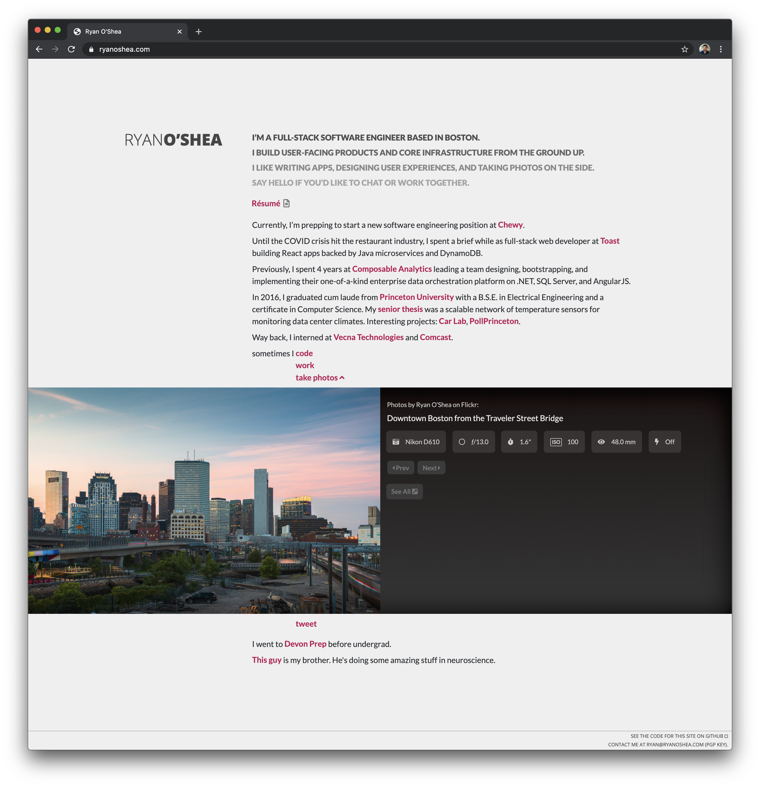
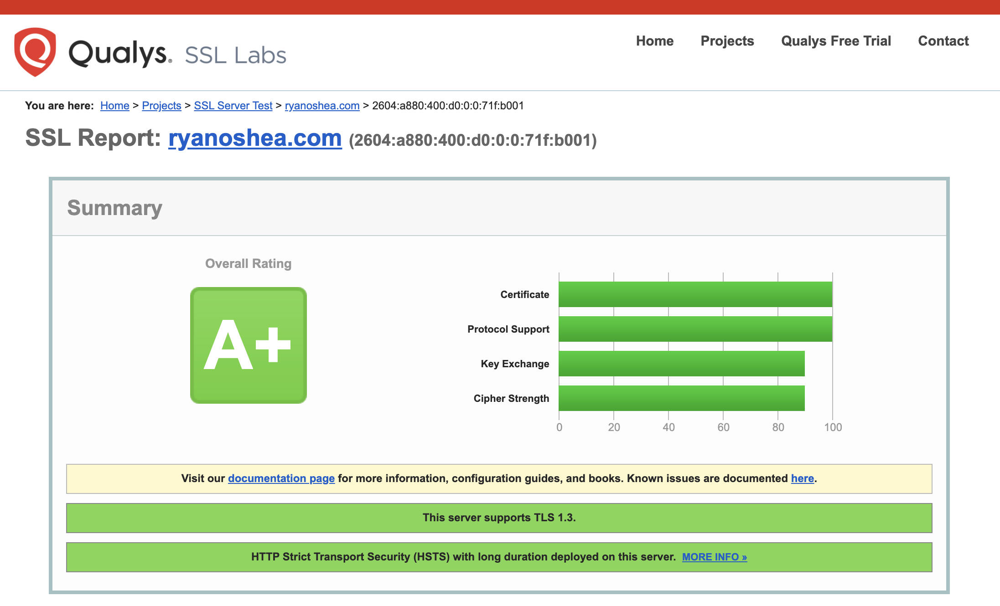
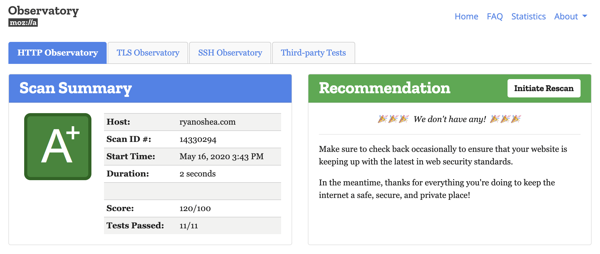

# ryanoshea.com

This repo contains a React SPA powering my personal website at <https://ryanoshea.com>, backed by a Node.js implementation of a secure HTTP/2 server pulling double-duty as a static file and read API service.

## React Front-end

Client-side code for [ryanoshea.com](https://ryanoshea.com), which uses [Vite](https://vitejs.dev/) for its build toolchain, which provides lightning-fast HMR for local development thanks to [native ES modules and esbuild](https://vitejs.dev/guide/why.html).

The site contents itself were originally written back in 2012 in PHP and jQuery, then ported to AngularJS before eventually landing on React in May 2020. Originally, it was based on [Create React App](https://create-react-app.dev/), with Webpack under the hood, until a successful experiment with Vite left that build system behind. There may be some remnants of messy code left over due to my repeated habit of using this repo as a testbed for learning.

## Node.js Back-end

The back-end server is a side project to maintain a Node.js server with an ideal HTTPS setup. The current implementation scores an **A+** on both the [Qualys SSL Labs](https://www.ssllabs.com/ssltest/analyze.html?d=ryanoshea.com&s=2604%3aa880%3a400%3ad0%3a0%3a0%3a71f%3ab001&latest) and [Mozilla Observatory](https://observatory.mozilla.org/analyze/ryanoshea.com) tests.

### Components

#### server.js

The Node.js server is based on the [`spdy`](https://www.npmjs.com/package/spdy) npm package for serving over HTTP/2. [`helmet`](https://www.npmjs.com/package/helmet) is used to serve security-related HTTP headers, including:

- `Strict-Transport-Security` (HSTS with preload)
- `Content-Security-Policy`
- `Referrer-Policy`
- `X-Content-Type-Options`
- `X-Frame-Options`
- `X-XSS-Protection`

[ExpressJS](https://expressjs.com/) is used for static page serving for the front-end React SPA. `server.js` is easily adaptable to any other project that involves static page serving over HTTPS.

#### app.js

`app.js` is a REST microservice for a few AJAX calls made by the front-end.

One handles fetching the contents of a portfolio album on Flickr. It uses [`flickr-sdk`](https://github.com/flickr/flickr-sdk) to fetch all the necessary details from Flickr's API. All of those requests take a while, so after the first set of requests, the server caches the results until the contents of the Flickr album change.

Another powers a dynamic “last-updated time” for my résumé. I often let this get out of date, so this call hits GitHub’s API (through [Octokit](https://github.com/octokit/core.js)) to obtain the timestamp of the last commit to the resume.pdf file in this repository.

Promises are used throughout. I've been meaning to port everything over to async/await, but haven't yet.

## Deployment

For now, CI/CD infrastructure is nonexistent. This personal site has no need for scaling and is designed to be deployed in a single-node setup on a VPS running Node natively. DigitalOcean is the current host, and there's a "one-click" deployment script that leverages rsync over SSH included in the `frontend` directory.

If you'd like to see what I can do to ship web apps and microservices at scale, you'll have to hire me. 🙂
