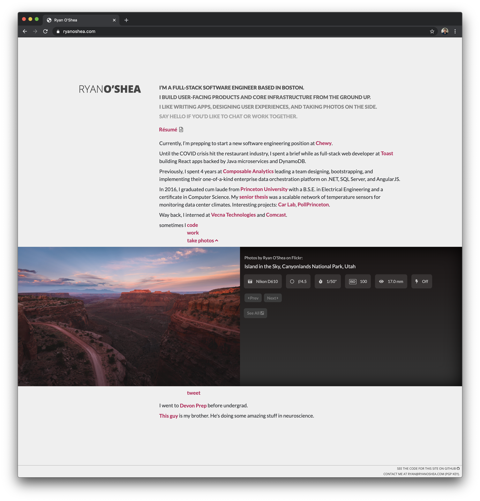

# `ryanoshea.com`

This repo contains a React SPA powering my personal website at <https://ryanoshea.com>, backed by a Node.js implementation of a secure HTTP/2 server pulling double-duty as a static file and read API service.

## Node.js Back-end

The back-end server is a side project to maintain a Node.js server with an ideal HTTPS setup. The current implementation scores an **A+** on both the [Qualys SSL Labs](https://www.ssllabs.com/ssltest/analyze.html?d=ryanoshea.com&s=2604%3aa880%3a400%3ad0%3a0%3a0%3a71f%3ab001&latest) and [Mozilla Observatory](https://observatory.mozilla.org/analyze/ryanoshea.com) tests.

### Components

#### server.js

The Node.js server is based on the [`spdy`](https://www.npmjs.com/package/spdy) npm package for serving over HTTP/2. [`helmet`](https://www.npmjs.com/package/helmet) is used to serve security-related HTTP headers, including:

- `Strict-Transport-Security` (HSTS with preload)
- `Content-Security-Policy`
- `Referrer-Policy`
- `X-Content-Type-Options`
- `X-Frame-Options`
- `X-XSS-Protection`

[ExpressJS](https://expressjs.com/) is used for static page serving for the front-end React SPA. `server.js` is easily adaptable to any other project that involves static page serving over HTTPS.

#### app.js

`app.js` is a REST microservice for the single AJAX call made by the front-end — fetching the contents of a portfolio album on Flickr. It uses [`flickr-sdk`](https://github.com/flickr/flickr-sdk) to fetch all the necessary details from Flickr's API. All of those requests take a while, so after the first set of requests, the server caches the results until the contents of the Flickr album change.

## React Front-end Single-page App

Client-side code for [ryanoshea.com](https://ryanoshea.com). This was originally written in AngularJS/jQuery and ported to React in May 2020. There may be some remnants of messy code left over as a result.
